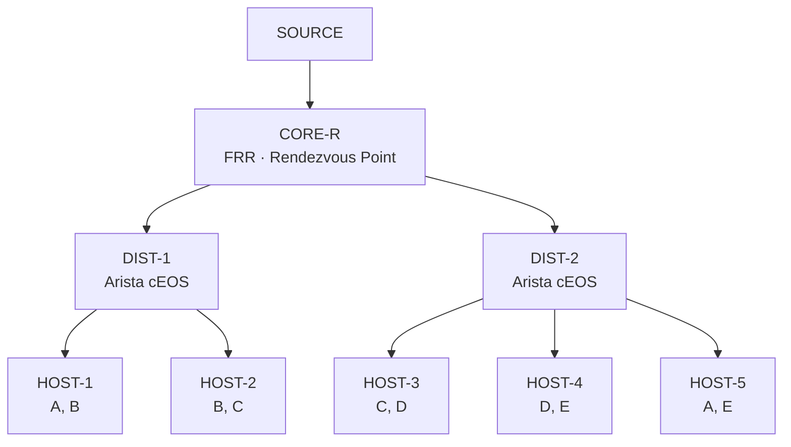

# The Concept

Simulate a company's internal network distributing 5 video channels to employees. A single source streams all 5 channels simultaneously — each host subscribes only to the 2 it needs. The network delivers traffic exclusively where it has been requested, nowhere else.


Built with **Containerlab**: FRR as the core router and Rendezvous Point, Arista cEOS as distribution switches, Linux containers as source and receivers.


---

## Multicast Groups

| Group | Channel |
|-------|---------|
| `239.1.1.1` | Channel A |
| `239.1.1.2` | Channel B |
| `239.1.1.3` | Channel C |
| `239.1.1.4` | Channel D |
| `239.1.1.5` | Channel E |

---

## Receiver Subscriptions

| Host | Joins |
|------|-------|
| HOST-1 | A, B |
| HOST-2 | B, C |
| HOST-3 | C, D |
| HOST-4 | D, E |
| HOST-5 | A, E |

Channel B reaches two different network branches. Channel A reaches two hosts on opposite sides of the topology. This overlap is intentional — it lets you verify the multicast tree is built correctly and traffic only flows where it should.

---

## Topology



---

## Streaming Approach

Python scripts — simpler in containers, more instructive than real video.


**Sender**

5 threads, each blasting UDP multicast to its group:

```
FEED-A | seq=1042 | ts=1709584823.4
```

<--->
**Receiver**

Binds to its 2 groups and prints incoming packets. Only sees what it joined.



Swap in `ffmpeg` with test-pattern video later if a visual demo is wanted.


---

## What the Lab Proves


- `show ip mroute` on DIST-1 only shows groups A, B, C — D and E don't appear (no downstream subscriber)
- `show ip igmp groups` on each switch shows exactly the 2 groups that host joined
- Kill CORE-R → watch PIM reconverge
- Add a sixth host joining any group → watch the multicast tree extend to a new branch

