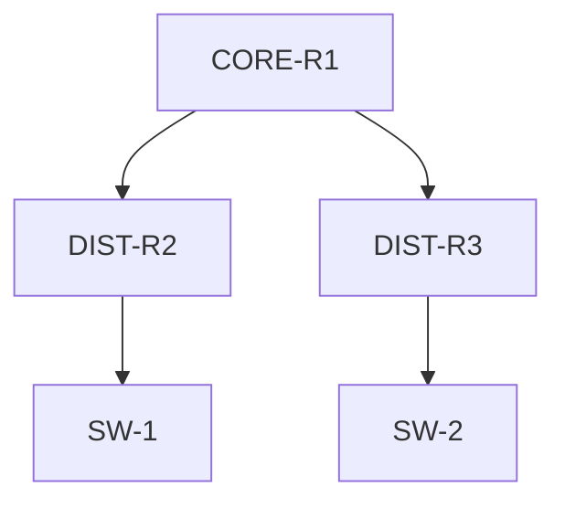

# Hugo Cheatsheet

Quick reference for this site's stack: Hugo + hugo-book theme + GitHub Pages.

---

## CLI Commands

```bash
# Start local dev server (includes drafts)
hugo server --minify --buildDrafts

# Build the site to /public
hugo --minify

# Create a new content file
hugo new docs/section/my-page.md

# Check Hugo version
hugo version
```

---

## Content Structure

```
content/
├── _index.md           <- home page
└── docs/
    ├── _index.md       <- section root (shows in sidebar)
    └── my-section/
        ├── _index.md   <- makes it a collapsible section
        └── my-page.md  <- regular page
```

- `_index.md` in a folder = section (collapsible group in sidebar)
- Regular `.md` files = leaf pages (no children)
- No `_index.md` = Hugo won't list the folder as a section

---

## Front Matter

```yaml
---
title: "Page Title"
weight: 10               # controls sidebar sort order (lower = higher)
draft: true              # hides from production build, shows with --buildDrafts
bookCollapseSection: true  # section starts collapsed in sidebar
bookFlatSection: false   # if true, children show at same level as parent
bookHidden: true         # hides from sidebar but page is still accessible
---
```

Weight sorting: lower numbers float up. Use increments of 10 so you can insert pages later without renumbering everything.

---

## hugo-book Shortcodes

### Hints (callout boxes)

```

This is an info box.

```

Variants: `info`, `warning`, `danger`

### Tabs

```


show ip route


show ip route


```

### Details (collapsible)

```

Hidden content here.

```

### Columns

```

Left column content
<--->
Right column content

```

---

## Mermaid Diagrams

Hugo-book has built-in Mermaid support. Just use a fenced code block with `mermaid`:

````

````

Useful diagram types: `graph`, `sequenceDiagram`, `flowchart`, `classDiagram`

---

## Images

Put images in `static/images/` and reference them from the root:

```markdown

```

The `static/` directory maps to `/` on the built site, so `static/images/foo.png` becomes `/images/foo.png`.

For large media (screen recordings), use `.mp4` or `.webm`. Raw HTML works since `unsafe = true` is set:

```html
<video controls width="100%">
  <source src="/images/my-demo.mp4" type="video/mp4">
</video>
```

---

## hugo.toml Key Params

```toml
[params]
  BookTheme = 'auto'       # 'light', 'dark', or 'auto' (follows OS)
  BookToC = true           # per-page table of contents (right sidebar)
  BookSection = 'docs'     # which content section drives the sidebar
  BookSearch = true        # flexsearch-powered search bar
  BookComments = false     # Disqus/utterances comments
  BookEditLink = '...'     # "Edit this page" link pointing to GitHub
```

```toml
[markup.tableOfContents]
  startLevel = 2   # h2 is the first ToC entry
  endLevel = 4     # goes down to h4
```

---

## Deployment

Push to `main` and GitHub Actions handles the rest. The workflow:

1. Checks out the repo (with submodules for the theme)
2. Builds with `hugo --minify`
3. Uploads `./public` as a Pages artifact
4. Deploys to GitHub Pages

Build takes about 30-60 seconds. Check the Actions tab on GitHub if something looks off.

---

## Common Gotchas

| Problem | Fix |
|---------|-----|
| Page not in sidebar | Add `_index.md` to the parent folder |
| Images broken | Path must start with `/` (e.g. `/images/foo.png`, not `images/foo.png`) |
| Draft page shows in production | Remove `draft: true` or don't pass `--buildDrafts` |
| Section won't collapse | Add `bookCollapseSection: true` to the `_index.md` front matter |
| Sort order wrong | Check `weight` values, lower = higher in list |
| Shortcode renders as raw text | Make sure you're using the right quote style (backtick fences, not indented blocks) |
| Theme not loading | Run `git submodule update --init --recursive` |
